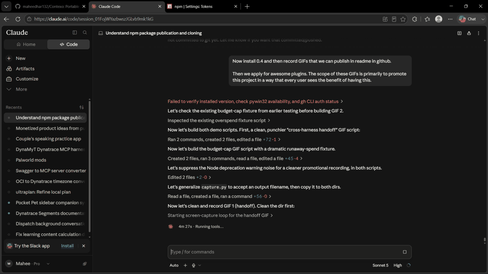
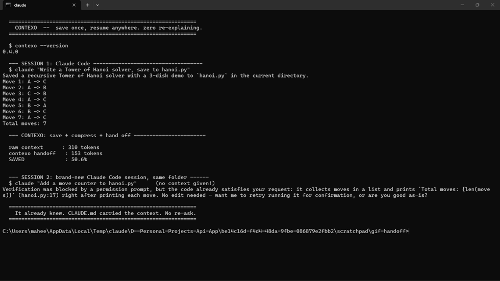

# Contexo

**Portable AI context and cost control across every AI coding harness.**

Stop paying twice. Contexo saves your work in one harness (Claude Code, Codex, Cursor…) and hands it off to another in a single command — compressed, so the new session starts from the right place at near-zero token cost.

<p align="center">
  
</p>

**A brand-new Claude Code session, given a prompt that never mentions the file it's about to edit, already knew.** `CLAUDE.md` carried the context — no re-explaining, ~50% fewer tokens than replaying the raw session.

<p align="center">
  
</p>

**A wrapped agent that just keeps spending gets killed the instant it crosses your cap.** No $200 surprise at the end of the month.

## Install

```bash
npm i -g @maheedhar132/contexo
# or, one-off
npx -y @maheedhar132/contexo --help
```

The command is `contexo` either way — the package name is scoped, the CLI binary isn't.

## 30-second tour

```bash
# 1. Save the current session (paste a transcript or point at a file)
contexo save --file ./chat.md --name "auth refactor"

# 2. See what you've got
contexo sessions

# 3. Hand off to another harness — compressed, ready to resume
contexo handoff cursor

# 4. Know the cost before you fire
echo "Refactor this file to use zod" | contexo estimate --all

# 5. Cap your daily spend and let Contexo enforce it
contexo budget set 5.00
contexo run -- claude "fix the failing tests"

# 6. See what you've saved so far
contexo stats
```

## What Contexo actually does

- **Cross-harness handoff.** Save a session in one harness, resume in another with a compressed context that captures decisions, changes so far, and the next step. No re-explaining.
- **Cumulative, diff-aware handoffs.** Chain sessions across a whole journey with `contexo save --continues <id>` — Claude Code → Codex → Cursor — and `handoff` compresses the *entire* chain, not just the latest hop. It also reads whatever handoff is already sitting in the target file and reconciles against it, so a decision you reversed three hops ago doesn't get confidently restated as current.
- **Auto-compact.** No harness gives an MCP server a "the session is about to close" event, so Contexo's `skill` instructs the agent to call `save_context` proactively — at natural checkpoints, when a session is clearly wrapping up, or as it approaches a context limit — instead of waiting to be asked. See [Auto-compact](#auto-compact) below.
- **Know what you saved.** `contexo stats` (and the MCP `list_sessions` tool's `savings_summary`) shows approximately how many tokens and dollars Contexo has saved you, locally, no account required.
- **Dead ends carry forward.** The brief has a dedicated section for approaches that were tried and abandoned, with why — the single biggest source of wasted agent time is re-attempting something already ruled out. Unlike Decisions, Dead ends accumulate across every hop in a chain instead of being overwritten.
- **Cost preflight.** `contexo estimate` tokenizes your prompt against every supported model and shows what a run will cost *before* you send it.
- **Hard budget cap.** `contexo run` wraps your agent, watches spend in real time, and terminates the process at your daily cap. No more $200 surprises.
- **Works with your existing tools.** Ships as an MCP server (Claude Code, Cursor, Cline, Windsurf) and as a config-file injector (Codex `AGENTS.md`, Claude `CLAUDE.md`, Cursor `.cursorrules`).
- **Runs 100% offline in the free tier.** SQLite on your machine. No account required.

## Architecture

```
┌───────────────────────────────────────────────────────┐
│ Claude Code   Codex CLI   Cursor    (Cline/Windsurf) │
└──────┬────────────┬──────────┬────────────────────────┘
       │ MCP        │ AGENTS.md│ MCP + .cursorrules
       ▼            ▼          ▼
   ┌──────────────────────────────────────────────┐
   │  Contexo CLI + MCP server (Node/TypeScript)  │  ← this repo (Apache 2.0)
   │  • local SQLite session store                │
   │  • tokenizers + cost table                   │
   │  • harness adapters                          │
   │  • local compression (your API key)          │
   └──────────────────┬───────────────────────────┘
                      │ HTTPS (Pro tier, optional)
                      ▼
   ┌──────────────────────────────────────────────┐
   │  Contexo Cloud (closed, coming soon)         │
   │  • compression-as-a-service                  │
   │  • learned cost prediction                   │
   │  • cross-machine sync                        │
   │  • team dashboards                           │
   └──────────────────────────────────────────────┘
```

## Install as a plugin — no `npm install` required

Contexo ships as a plugin, not just an npm package. The MCP server launches
via `npx`, so a harness's own plugin manager can pull and run it on demand —
you never have to `npm i -g` anything yourself.

**Claude Code** (uses its own plugin/marketplace format, `.claude-plugin/`):

```
/plugin marketplace add maheedhar132/Contexo
/plugin install contexo
```

**Codex, Cursor, GitHub Copilot, VS Code, Kiro, ChatGPT** (via the
cross-vendor [Agent Plugins 1.0](https://github.com/agentplugins/agent-plugins-spec)
standard — `plugin.json` + `mcp.json` + `skills/` at the repo root): add
this repo as a plugin source in whichever of those clients you use; each
reads the same manifest.

Either path gives the agent five tools (`save_context`, `write_handoff`,
`load_context`, `estimate_cost`, `list_sessions`) plus a `contexo` skill
describing when to use them. `save_context` + `write_handoff` together do a
complete handoff — the agent compresses using its own model access and
Contexo just stores and writes it, no API key involved. `budget` and `run`
stay CLI-only, since wrapping and killing an external process isn't
something an MCP tool call can do.

## Wire Contexo into Claude Code manually

If you'd rather configure the MCP server by hand instead of installing the
plugin, add to your Claude Code MCP config:

```json
{
  "mcpServers": {
    "contexo": { "command": "npx", "args": ["-y", "@maheedhar132/contexo", "mcp"] }
  }
}
```

(Already have it installed globally? `{ "command": "contexo", "args": ["mcp"] }` works too.)

Claude Code now sees five tools: `save_context`, `write_handoff`, `load_context`, `estimate_cost`, `list_sessions`.

## Wire Contexo into Cursor manually

Cursor supports MCP the same way. In `~/.cursor/mcp.json`:

```json
{ "mcpServers": { "contexo": { "command": "npx", "args": ["-y", "@maheedhar132/contexo", "mcp"] } } }
```

## Wire Contexo into Codex

Codex reads `AGENTS.md`. Run:

```bash
npx -y @maheedhar132/contexo handoff codex
```

Contexo writes a `<!-- contexo:context:start -->` block into your project's `AGENTS.md`. Codex picks it up automatically. Re-running `handoff` replaces the block cleanly.

## Cost estimation — honest numbers

- OpenAI models use `tiktoken` (exact).
- Anthropic models use `cl100k_base` as a proxy (typically ±5–10%). We flag those results with `~`.

Update the pricing table in [`src/cost.ts`](src/cost.ts) as providers change prices.

## Compression, honestly

There are two paths, and only one of them needs an API key.

**Running as an MCP tool inside an agent (Claude Code, Cursor, Codex) — no key needed.** The agent already has model access under your existing subscription for that tool. Contexo's `save_context` tool takes a `compressed_context` param and its `write_handoff` tool writes the finished brief straight into the target file — so the *agent* compresses using the same Task/Decisions/Dead ends/Next-step format Contexo would use, and Contexo just stores and writes it. No separate, redundant, separately-billed model call.

**Running `contexo handoff` from a bare terminal, no agent in the loop — needs `ANTHROPIC_API_KEY`.** There's no agent to delegate to here, so Contexo makes its own call to Anthropic Haiku (see [`src/compress.ts`](src/compress.ts)), roughly **$0.001 per compression**. This is the fallback path, not the primary one — most real usage goes through the MCP tools above.

Contexo Pro will remove even this fallback's key requirement by running compression on our servers.

**We do not claim "zero token" handoffs.** Loading context into a new session always costs input tokens. What you get:

- ~90–95% smaller payload than replaying full history.
- Cache-friendly single block (Anthropic prompt caching gives 90% discount on reuse within TTL).
- Zero re-onboarding cost — the new agent doesn't have to ask 20 clarifying questions.

## Auto-compact

There's no cross-harness "session is about to close" event Contexo can listen
for — no MCP server gets pushed that signal, and Contexo has no background
daemon watching your terminal. So auto-compact is handled the only way that
actually works everywhere: the `contexo` skill (`skills/contexo/SKILL.md`)
tells the agent to call `save_context` proactively — at checkpoints, when the
task looks like it's wrapping up, or as context grows long — rather than
waiting for you to say "save this." Since `save_context` accepts your own
`compressed_context` and costs nothing extra to call, there's no reason for
the agent to wait.

If your harness supports lifecycle hooks (Claude Code does, via
`SessionEnd`/`Stop` hooks in `.claude/settings.json`), you can additionally
wire a raw-save fallback so *something* always gets persisted even if the
agent didn't proactively save:

```json
{
  "hooks": {
    "SessionEnd": [
      { "hooks": [{ "type": "command", "command": "npx -y @maheedhar132/contexo save --file -" }] }
    ]
  }
}
```

This is a best-effort fallback, not a substitute — a hook can only persist
raw text, not a compressed brief (that needs the agent's own reasoning), and
no equivalent hook exists in Codex or Cursor today. The skill-driven proactive
save above is what actually covers every harness.

## Pricing (planned)

| Tier | Price | Contents |
|---|---|---|
| **Free** (this repo) | $0 | Local everything: save/load, MCP server, adapters, budget cap, cost estimator, compression via your API key, local `contexo stats` savings summary |
| **Pro** | $9/mo | Cloud sync across machines (E2E encrypted), compression-as-a-service, learned cost model, budget alerts, session search, a hosted "$ saved" dashboard aggregating stats across every machine/session |
| **Team** | $29/user/mo | Shared team context, team-wide budgets, dashboards, SSO |
| **Enterprise** | from $2K/mo | Self-hosted, SOC 2 path, SIEM exports (Dynatrace/Datadog/Splunk), custom skill packs |

## Development

```bash
git clone https://github.com/maheedhar132/Contexo.git
cd Contexo
npm install
npm run build
node dist/cli.js --help
```

Run tests: `npm test`. Type-check: `npm run typecheck`.

## License

Apache 2.0 — see [LICENSE](./LICENSE).

## Trademark

"Contexo" and the Contexo logo are pending trademarks of the project maintainer. Forks and derivative works are welcome under the Apache 2.0 license, but must not use the "Contexo" name or logo to identify themselves. See [TRADEMARK.md](./TRADEMARK.md).
